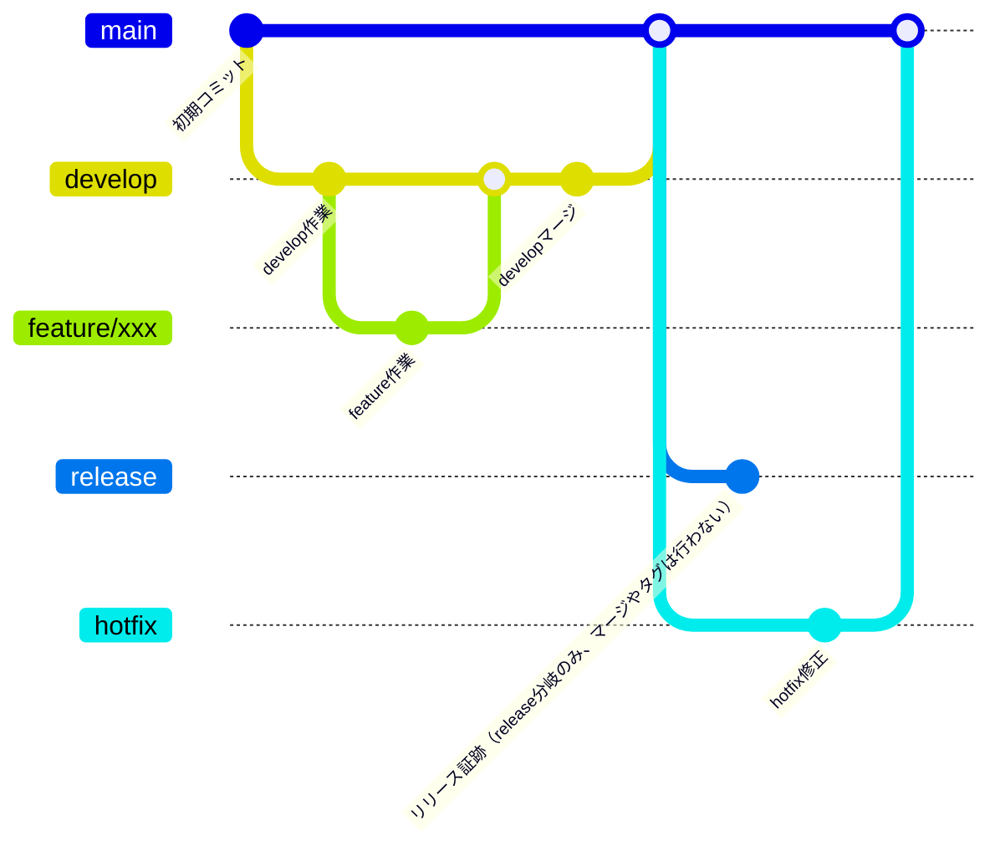

# プロジェクト概要
このリポジトリは、ゲームコミュニティ用システムのボット構築・運用を目的としています。\
ris- で始まる各種リポジトリ（例: ris-bot-discord, ris-infra-core など）は、インフラ・開発共通の基盤として ris-infra-core リポジトリを中心に構成、PRテンプレート、ビルド用シェルスクリプト等を管理しています。\
運用や開発の詳細、共通ルール・テンプレートの最新版は ris-infra-core リポジトリを参照してください。

> **NOTE:**
> 本リポジトリのPRテンプレート、ビルド用sh等は ris-infra-core で一元管理されており、運用ルールやテンプレートの最新情報は ris-infra-core をご確認ください。
> [ris-infra-core リポジトリはこちら](https://github.com/deidra-JP-windows/ris-infra-core)

## 目次
- [プロジェクト概要](#プロジェクト概要)
- [ディレクトリ・ファイル構成（featurebot_youtube_serach ブランチ例）](#ディレクトリファイル構成featurebot_youtube_serach-ブランチ例)
  - [ローカル常駐型Bot（デーモン運用）について](#ローカル常駐型botデーモン運用について)
  - [GitHub ActionsによるバッチBotの定期実行](#github-actionsによるバッチbotの定期実行)
- [開発環境セットアップ](#開発環境セットアップ)
  - [クイックスタート](#クイックスタート)
  - [必要な環境・ツール](#必要な環境ツール)
  - [VS Code拡張機能（推奨）](#vs-code拡張機能推奨)
  - [外部の拡張機能](#外部の拡張機能)
  - [開発環境](#開発環境)
  - [プッシュ](#プッシュ)
  - [ブランチ運用フロー](#ブランチ運用フロー)
  - [コミットメッセージ](#コミットメッセージ)
  - [PRテンプレート](#prテンプレート)
    - [注意事項](#注意事項)
  - [実行](#実行)
  - [デストロイ](#デストロイ)
- [CI/CD（GitHub Actions）](#cicdgithub-actions)
  - [CI（継続的インテグレーション）](#ci継続的インテグレーション)
  - [CD（継続的デリバリー）](#cd継続的デリバリー)
    - [補足](#補足)
- [仕組み](#仕組み)
- [追加方法](#追加方法)
- [GitHub運用方針](#github運用方針)
- [テストについて](#テストについて)
  - [テストの実行方法](#テストの実行方法)
- [コード品質チェック](#コード品質チェック)
  - [ツールのインストール](#ツールのインストール)
  - [注意点](#注意点)
- [FAQ（よくある質問）](#faqよくある質問)
- [サポート・問い合わせ](#サポート問い合わせ)


## ディレクトリ・ファイル構成（feature/bot_youtube_serach ブランチ例）

- /documents/systems : システム全体の設計・運用に関するドキュメント（構成図、要件定義書、仕様書等）
- /riften_web_infra/terraform/00_modules/ : Terraformモジュール群
- /build_command.sh : ビルド・起動・停止等のコマンド管理用シェルスクリプト
- /Dockerfile : 開発環境用Dockerイメージ定義ファイル
- /README.md : プロジェクト概要・運用ルール等のドキュメント
- /.gitignore : Git管理対象外ファイル定義
- /bots/batch/ris-bot-birthday-manjuuu/main.py : バッチBot本体（誕生日通知・YouTube連携等）
- /bots/batch/ris-bot-birthday-manjuuu/requirements.txt : Bot用Python依存パッケージ定義
- /bots/batch/ris-bot-birthday-manjuuu/services/add_youTube_playlist.py : YouTube再生リスト追加処理
- /bots/batch/ris-bot-birthday-manjuuu/services/birthday_notification.py : 誕生日通知処理
- /bots/batch/ris-bot-birthday-manjuuu/services/__pycache__/ : Pythonキャッシュ
- /bots/local/ris-client-info-manjuuu/main.py : ローカル常駐型Bot本体（コマンド受信・応答）
- /bots/local/ris-client-info-manjuuu/services/randam_string_service.py : 文字列生成、履歴取得、5-7-5判定などのサービス
- /tooles/json2base64.sh : JSONファイルをbase64変換するユーティリティ


### ローカル常駐型Bot（デーモン運用）について
`bots/local/` ディレクトリには、デーモン化して常時稼働させるタイプのBot、またはクライアントを実装・運用します。
これらは今後、自身のPCではなく専用のRaspberry Pi（ラズパイ）上で常時稼働させる予定です。
運用・セットアップ手順や注意事項は各BotのREADMEや今後のドキュメントで案内します。

### GitHub ActionsによるバッチBotの定期実行
`bots/batch/` 配下の各Pythonプロジェクト（例: `ris-bot-birthday-manjuuu`）は、GitHub Actionsにより毎日自動で実行されます。

## 開発環境セットアップ
### クイックスタート
最短で開発を始めるための手順です。

1. 開発コンテナを初回起動します。
```bash
bash build_command.sh first-up
```

2. 既に初回起動済みの場合は通常起動します。
```bash
bash build_command.sh up
```

3. コンテナへ接続します。
```bash
bash build_command.sh exec
```

4. VS CodeでDev Containersとして開きます。
  - Remote Explorer -> Dev Containers から対象コンテナへ Attach in New Window

5. バッチBotを手動確認する場合は対象ディレクトリへ移動して実行します。
```bash
cd bots/batch/ris-bot-birthday-manjuuu
python main.py
```

### 必要な環境・ツール
- OS: Windows 11 以上（Mac/Linuxも可）
- 必須: `wsl`, `git`, `docker`, `openssh`（鍵作成）
- 推奨: VS Code（拡張機能「Dev Containers」）

### VS Code拡張機能（推奨）
- Draw.io Integration : VS Code上でDraw.io編集
- Markdown Preview Mermaid Support : Mermaid記法プレビュー

### 外部の拡張機能
効率的な開発を行う為、個人開発の拡張機能で以下の2つを採用しています。
- Draw.io Integration
  - VS Code で Draw.io を操作することが可能
- Markdown Preview Mermaid Support
  - マーメイド記法で書かれたコードをプレビューすることが可能

### 開発環境
以下のコマンドを`Git Bash`環境で実行してください。
コンテナ起動後、リポジトリを `Dev Containers` で開いてください。
```
# 初回起動時
bash build_command.sh first-up
```
```
# 起動時
bash build_command.sh up
```
```
# 接続時
bash build_command.sh exec
# 上記のコマンド、または Remote Explorer → Dev Containers からコンテナを選択し、Attach in New Window からコンテナを起動・接続してください。
```
```
# コンテナ停止時
bash build_command.sh stop
```
```
# イメージ更新時
bash build_command.sh rebuild
```
```
# コンテナ削除
bash build_command.sh down
```

### プッシュ
※リリースなどは原則行わない想定ですが、汎用的なフローとして順守してください。
github に差分をプッシュする際には git-flow を簡略化し運用してください。Github Actions などの実装を簡略化するためタグは使用しません。
- git-flow
  - https://www.atlassian.com/git/tutorials/comparing-workflows/gitflow-workflow

| ブランチ名      | 用途・説明                                      | 直接プッシュ禁止 | マージ先          | ブランチ作成元     |
|:---------------|:-----------------------------------------------|:----------------|:-------------------|:-------------------|
| main           | stg・prod 環境へリリースするブランチ               | ○               | -                 | -            |
| release        | 本番リリース後証跡｜切り戻し用ブランチ              | ○               | -                 | main          |
| hotfix         | main へ修正を入れる際に使用（リリース後のバグ修正等）| ×               | main              | main               |
| develop        | dev 環境へリリースするブランチ                     | ○               | main              | -  |
| feature/*      | 作業ブランチ（ローカル・dev 環境での動作確認も実施） | ×               | develop           | develop            |


### ブランチ運用フロー
※リリースなどは原則行わない想定ですが、汎用的なフローとして順守してください。
Mermaid 記法のため必要に応じて VS Code に拡張機能をインストールしてください。
例：Markdown Preview Mermaid


#### GitHub Actions連携ポイント
feature/* → develop へのPR作成・更新時：
- CI（Secret Scan）が自動実行され、機密情報混入をチェック
- CI（Unit Tests）が自動実行され、テストが失敗した場合はマージをブロック

### コミットメッセージ
関数単位や同じ修正内容のまとまり単位でコミットしてください。
フォーマットに細かい指定はないですが、作業内容の概要だけ記載をお願いします。
例：[構成変更]_README修正


### PRテンプレート
本リポジトリのPRテンプレート（.github/PULL_REQUEST_TEMPLATE.md）は ris-infra-core リポジトリで管理されている共通テンプレートをベースにしています。
PR作成時は ris-infra-core のテンプレートや運用ルールも参考に、必要事項を記載してください。

#### 注意事項
- PRのタイトル・説明は分かりやすく記載してください。
- レビュワーが確認しやすいよう、必要に応じてスクリーンショットや補足説明を追加してください。
- テンプレートは`.github/PULL_REQUEST_TEMPLATE.md`で管理しています。必要に応じて編集・拡張してください。

### 実行
本リポジトリでは、バッチBotの実行は手動ではなくGitHub Actionsを利用して自動化されています。

- `.github/workflows/batch_bots.yml` により、`bots/batch/` 配下の各Botプロジェクト（`main.py`）が毎日自動で実行されます。
- 必要な環境変数でセキュアなデータ（DISCORD_BOT_TOKEN）はGitHubリポジトリのSecretsに設定し、ワークフローから自動で渡されます。
- その他環境変数（READ_BIRTHDAY_CHANNEL_ID, SEND_GENERAL_CHANNEL_ID 等）は直接値をセットしています。
- 手動実行もGitHub Actionsの「workflow_dispatch」から可能です。

### デストロイ
ディレクトリを別で切り移動させることで実行されなくなります。

## CI/CD（GitHub Actions）
本リポジトリのCI/CDは以下のようにシンプルな運用としています。

### CI（継続的インテグレーション）
- プッシュ・PR作成時に、コードや設定ファイル内にDiscordのBotトークン等の機密情報が含まれていないか自動チェックを行います。
  - Discord Bot Tokenの形式（`[MN][英数字23文字].[英数字6文字以上].[英数字27文字以上]`）を検出し、漏洩を未然に防止します。
- ユニットテストの自動実行を行います。
  - `bots/tests/batch/` 配下の全テストを自動実行し、失敗時はPRマージをブロックします。
  - テストが存在するBotについては品質を担保した上でマージが可能になります。

### CD（継続的デリバリー）
- CDは「特定ディレクトリへのファイル追加」のみを自動化対象としています。
  - 例: bots/batch/ 配下への新規Bot追加や、必要なファイルの配置など。
- サーバー等への自動デプロイや本番反映は行いません。

#### 補足
- CI/CDの詳細な設定やルールは ris-infra-core リポジトリも参照してください。

## 仕組み
- `.github/workflows/batch-bots.yml` により、`bots/batch/` 配下の各サブディレクトリで `requirements.txt` があれば依存をインストールし、`main.py` を実行します。
- 毎日0時（JST）に自動実行されます。
- 手動実行も可能です。

## 追加方法
新しいバッチBotを追加する場合は、`bots/batch/` 配下にディレクトリを作成し、`main.py` と必要に応じて `requirements.txt` を配置してください。

## GitHub運用方針
- **Collaborators and teams** で許可したユーザーのみWrite権限を付与し、不要なユーザーのpush権限を制限します。
  - 原則管理者以外、全て外部コントリビューターとして意図しない変更・ワークフローの実行などを制限します。
  - 以下の状態になります。
    - 管理者のみが直接pushできる
    - 外部からの変更は全てPull Request経由となる
    - Pull Requestのマージ権限も管理者のみが持つ
- **GitHub Actions の設定**（Approval for running fork pull request workflows）で **Require approval for all external contributors** を有効化し、外部コントリビューター起点のWorkflow実行はメンテナー承認必須とすることで、意図しないWorkflow実行を防止します。
- **Secret Protection** を有効化し、リポジトリ全体でシークレット漏洩リスクを継続的に監視します。
  - 既知パターンのシークレット（トークン・鍵など）を検出し、意図しない公開を早期に把握します。
- **Push protection** を有効化し、シークレットを含むコミットのpushを事前にブロックします。
  - 開発者がリモートへpushする前段階で警告・ブロックされるため、漏洩にプッシュ前に気づける運用とします。
- **rulesetの導入**により、以下のブランチ保護・セキュリティ強化を実施します。
  - mainブランチへの直接push禁止（必ずPull Request経由）
  - Pull Request必須・レビュー必須（例: 1名以上の承認）
    - コードオーナーによるレビューのみ
  - force push禁止
  - 必須ステータスチェック（CI等の成功を必須化）
    - 必要に応じて追加
    - Terraform コマンドは基本手打ちで実行する想定（Github Actions の実行に料金が発生する、PR作成前に確認してほしい等）
  - シークレットスキャン（漏洩防止）
    - CI により実装

## テストについて

このプロジェクトでは、`unittest` フレームワークを使用してテストを実行しています。テストは `bots/tests/batch/ris-bot-birthday-manjuuu/` ディレクトリに配置されています。

### テストの実行方法

1. 必要な依存関係をインストールします。
  bot 実装時にインストールしている為、原則不要です。
   ```bash
   pip install -r requirements.txt
   ```

2. テストを実行します。
   ```bash
    cd bots/tests/batch/ris-bot-birthday-manjuuu
    python test_main.py
   ```

## コード品質チェック

このプロジェクトでは、コードの品質を保つために `black`（フォーマッター）と `flake8`（リンター）を使用しています。

### ツールのインストール
bot 実装時にインストールしている為、原則不要です。
```bash
pip install -r requirements.txt
```
# __pycache__ ディレクトリを削除
find bots/ -type d -name __pycache__ -exec rm -rf {} +

# .pycファイルを削除
find bots/ -type f -name "*.pyc" -delete

# フォーマットチェックのみ（修正しない）
black --check bots/

# 自動フォーマット実行（ファイルを修正）
black bots/

# リントチェック
- flake8で `E203`（スライス記法の空白）と `W503`（演算子前の改行）を除外しているのは、blackとの互換性のためです
flake8 bots/ --max-line-length=88 --extend-ignore=E203,W503

### 注意点
- テストではモックを使用しており、実際のDiscordサーバーへの接続は行いません。
- 各 bot のテストは原則テストサーバでの動作確認にとどめますが、複雑な計算ロジック & 集計などを含むケースのみテストコードを実装してください。

## FAQ（よくある質問）
Q. Windows以外でも開発できますか？
A. 開発環境コンテナ操作用スクリプトが Windows 用のパス指定になっている為、 Mac/Linux 環境は未対応です。

Q. Dev Containersが起動しない場合は？
A. Docker Desktopの再起動やVS Codeの再起動をお試しください。

Q. SSH鍵の作成方法は？
A. `ssh-keygen -t ed25519` で作成できます。

Q. コマンドが失敗する場合は？
A. コンテナの状態（起動/停止）を確認し、必要に応じて`build_command.sh`を実行してください。

## サポート・問い合わせ
不明点や要望はGitHub Issuesまたは担当者までご連絡ください。
