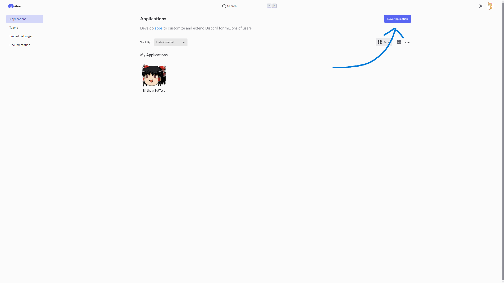
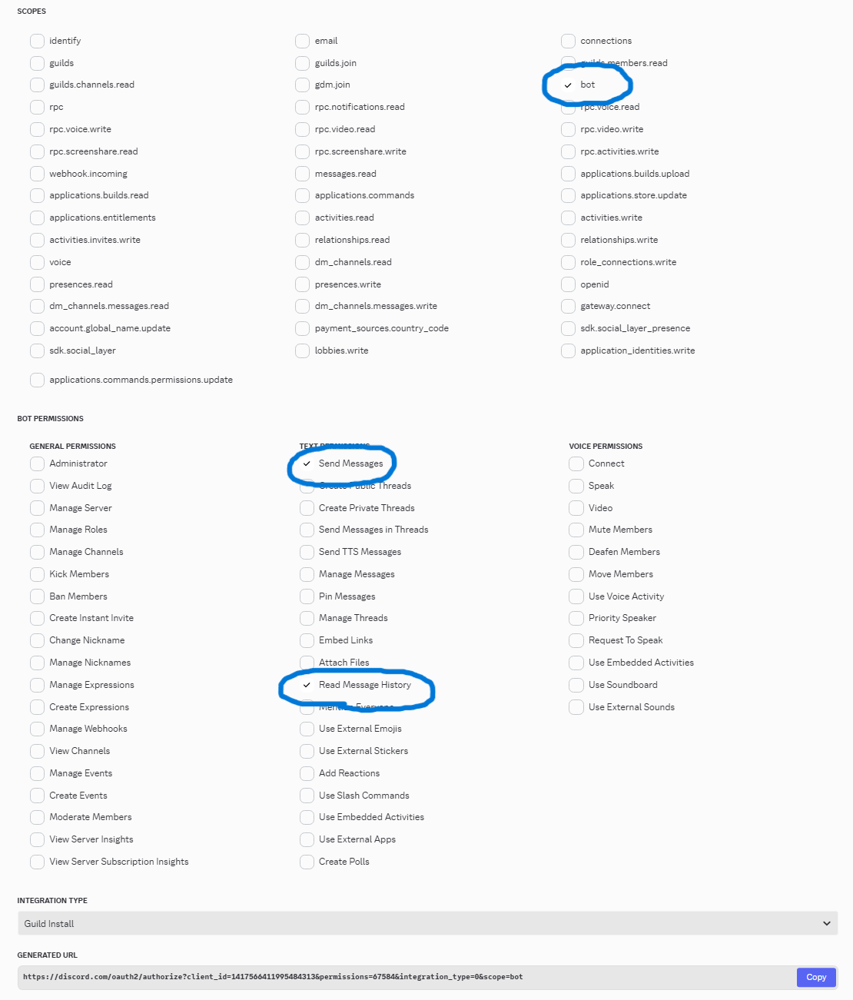
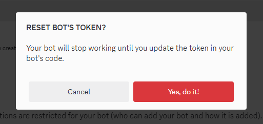
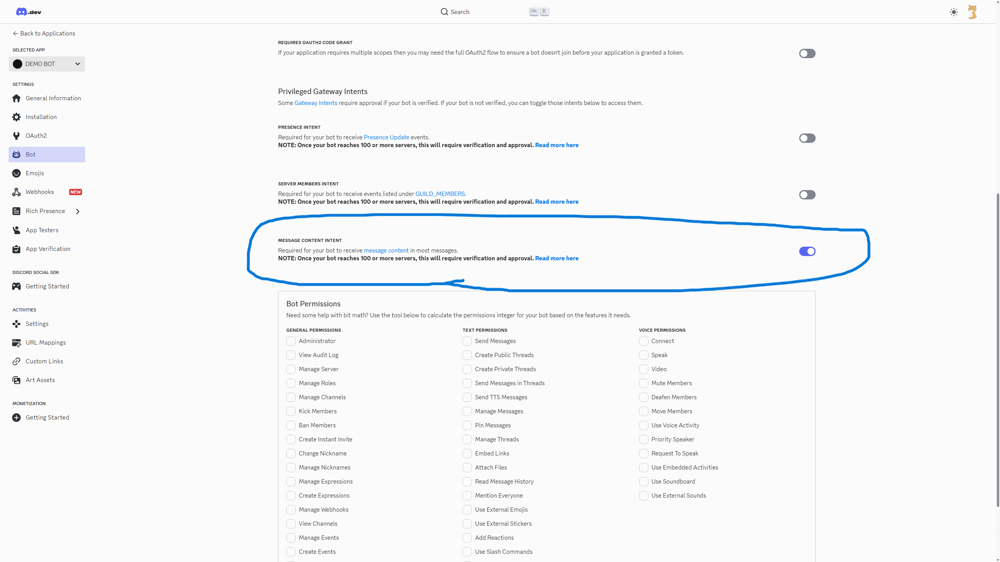

# Pythonで動くDiscordBotの作成方法

## 必要なもの
- Discordアカウント
- Pythonが動かせる環境

## 作成手順
### 1. Botアカウントの作成
- [Discord Developer Portal](https://discord.com/developers/applications)にアクセス
- 「New Application」→名前を入力→プライバシーポリシーに同意し[Create]


### 2. Botをサーバーに招待
- 左メニュー「OAuth2」→「OAuth2 URL Generator」
- 「SCOPES」で「bot」を選択
- 「BOT PERMISSIONS」で必要な権限（例: Send Messages, Read Message History）を選択
- 生成されたURLからBotをサーバーに追加



### 3. TOKENを取得

- 左メニュー「Bot」→「Reset Token」
- [Yes, do it!]



- 生成されたTOKENをコピーして誰にも見られない場所に保存する

### 4. メッセージ権限の付与

- 左メニュー「Bot」→「Message Content Intent」をオン→変更を保存
- これをオンにしてないとメッセージを送信できない



### 5. Botのコードを書く
- `main.py`という名前のファイルを作成し，以下をコピペ
```python
import discord
import os
from dotenv import load_dotenv

# .env読み込み
load_dotenv()
TOKEN = os.getenv("TOKEN")

intents = discord.Intents.default()
intents.message_content = True  # メッセージの内容を取得する権限

client = discord.Client(intents=intents)


@client.event
async def on_ready():
    """実行時に呼び出される処理"""
    print("こんにちはーー")


@client.event
async def on_message(message: discord.Message):
    """メッセージをおうむ返しにする処理"""

    if message.author.bot:  # ボットのメッセージは無視
        return

    await message.reply(message.content)  # リプライを投げる


if __name__ == "__main__":
    client.run(TOKEN)
```

- 同じ階層に`.env`という名前のファイルを作成し，中身を以下のようにする
```
TOKEN=[ここに3.で取得したTOKENを張り付ける]
```

### 6. Botの起動
- Discord.pyライブラリのダウンロード

```powershell
python -m pip install -U discord.py
```

- ソースコードの実行

```powershell
python main.py
```

- 「こんにちはーー」と表示されれば成功
- Botを招待したサーバーにメッセージを送信すると，同じ内容のリプライが返ってくる

### 7. Botの停止
- Ctrl+Cで停止（Windowsの場合）